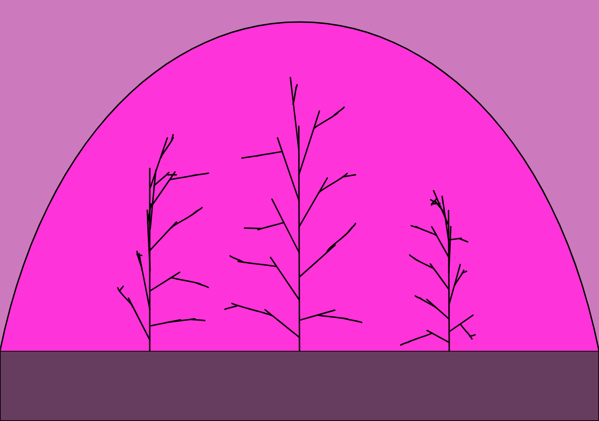
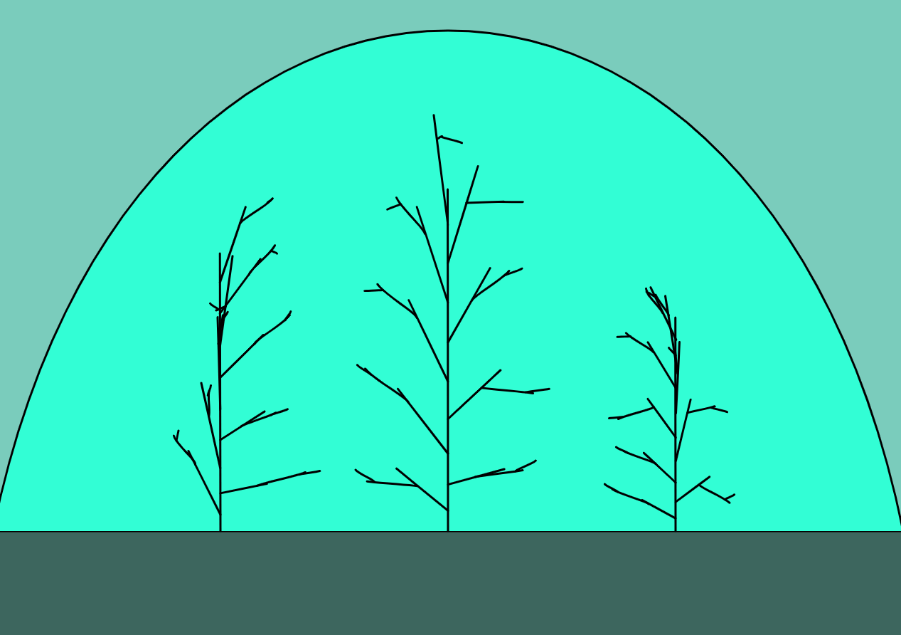
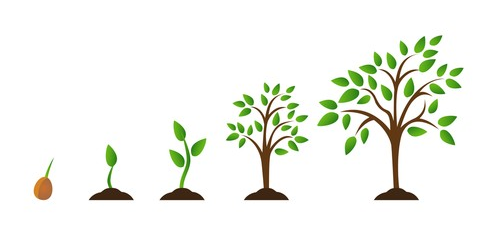
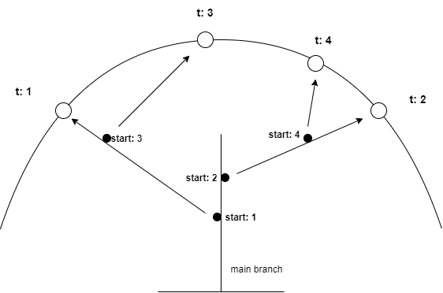
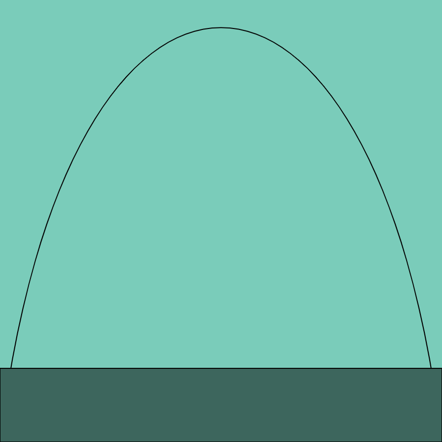

# Waving Reed in a snowglobe (p5.js)

## Introduction
In the previous article a talked about creating waving grass in a p5.js project using typescript. In this article I want to talk about a similar style of sketch but now with a focus on 'tree like structures' with branches as an intermediate step to the full blown trees. This project in the process to having actual trees I call 'Waving reed in a snowglobe'.

### Branches and growth
When you look at how nature makes trees grow there is some algorithmic logic to be easily distilled right? A sapling starts growing from a seed in the ground towards the sky (or is it away from gravity's pull). Once above ground it will grow further to the sky while expanding it's diameter becoming a more sturdy trunk and after a while branches appear. First one to the left then another to the right. These branches behave like the main branch, grow toward the light, increase in diameter (still relative to the main branch) and develop it's own sub branches.

There are loads of discussions on how to solve this problem, think of fractal like behaviour, attraction based growth algorithms etc.

## Sun as an attractor
For this implementations I started out with a very naive approach (I like naive very much) with a virtual walker object that will first draw the main branch, then at a certain point create a sub branch by walking in a certain direction (preferrably up and not down), preferrably in a different direction than previous, eg left vs right etc. That turned out to be rather complicated (and boring to be honest) because I ended up writing a lot of silly code like 

    - choose a point on a branch
    - determine the angle of the branch with it's parent branch
    - choose a new angle into a new part of space (based on the rules: not occupied yet and has more light available than the alternatives)
    - etc. 

As you can see a smart guy could pull this of but for me this felt like over-micro-engineering and I quickly realized I had to stop this foolishness. (learned a lot about the P5 Vector system though).

So in the next iteration I tried to solve the problem in another way. I introduced a sun object that traveled through a imaginary curve in the sky that was generating an attraction force that would be used by the growing branch to determine the direction and speed (or length if you will) of the growth.

## The sketch

# The code

## The snow globe
The snowglobe object is a tongue in cheek representation/visualisation of the arc at which the sun or attractor object can be found at the different intervals. The snowglobe object is a composite of a simple rectangle object at the bottom and a sun object represented by the curve.

## The sun
The sun object then basically is just a curve and an attractor positioned on the curve at time t.

    attract = (branch: P5.Vector, t: number): P5.Vector =>
    {
        const location = this._getLocation(t);
        const force = P5.Vector.sub(location, branch);
        let distance = force.mag();
        distance = this._p5.constrain(distance, 5.0, 25.0);
        force.normalize();
        const strength = this.solarForce * distance;
        force.mult(strength);
        return force;
    }

What I want to express here is a attraction force on a 'growing' branch. This force has a direct relation with the position of the 'sun' on the curve and the distance of the 'growing' branch and the attractor object.

_getLocation() is the function to determine a position on the curve at t where t between 0 and 1 usint p5's curvepoint function.

    _getLocation = (t: number): P5.Vector =>
    {
        const x = this._p5.curvePoint(
            this._curveStartControlX, 
            this._curveStartX,
            this._curveEndX, 
            this._curveEndControlX, 
            t);
        const y = this._p5.curvePoint(
            this._curveStartControlY, 
            this._curveStartY,
            this._curveEndY, 
            this._curveEndControlY, 
            t);
        const location = this._p5.createVector(x, y);
        return location;
    }

## The reedfactory
The reed factory class is where all the nasty growing of branches work is done. The reedfactory is constructed with details on the canvas we are drawing on and gets a reference to the sun object to determince the force at a certain moment in time.

Furthermore the reedfactory has the notion of the number of branches it needs to create.

    createReed = (x: number, height: number): Reed =>
    {
        const allBranches = this._create(x, height);
        const reed = new Reed(this._p5, allBranches);

        return reed;
    }

If we break down the _create function we can distill the following logic.

- create a main branch
- create a sub branch on this main branch (loop)
    - while doing that determine the general direction to grow to (EAST or WEST)
    - position the sun in the eastern of western 'hemisphere' 
    - create a branch starting from the parent in the direction of the sun (attractor)
    - and of course use some recursion for the sub branches:)

Create Main Branch

    _create = (x: number, height: number): Array<Branch> =>
    {
        const result = new Array<Branch>();
        const mainBranch = this._createMainBranch(x, height);
        result.push(mainBranch);

And 

    _createMainBranch = (x: number, height: number): Branch =>
    {
        const start = this._p5.createVector(x, height);
        const end = this._p5.createVector(x, this._drawHeight);
        const direction = P5.Vector.sub(start, end);
        direction.normalize().mult(1);
        const startControl = this._createStartControl(start, end);
        const endControl = this._createEndControl(start, end);

        const mainBranch = new Branch(this._p5, start, startControl, end, endControl, undefined, undefined);
        return mainBranch;
    }
    
Then 

## The reed and branch objects
The branch object is very similar to the grass object from my previous article with just a curve definition that and an animate function. The main difference is in the rewrite start function. The windforce that is moving the branch objects will change the curve of the object but that means that the connected branch is also moving. The rewritestart function makes sure that the curve's start stays connected to the parent branch.

    rewriteStart = (): void =>
    {
        if (this.parent)
        {
            const x = this._p5.curvePoint(
                this.parent.startControl.x, 
                this.parent.start.x, 
                this.parent.end.x, this.parent.endControl.x, 
                this.level);
            const y = this._p5.curvePoint(
                this.parent.startControl.y, 
                this.parent.start.y, 
                this.parent.end.y, 
                this.parent.endControl.y, 
                this.level);
            this.end = this._p5.createVector(x, y);
        }
    }

The reed object is then actually just a container object for the interconnected branches with a display and an animate function to display and animate the branches.

    display = (debug: boolean):void =>
    {
        this._branches.forEach(element => 
        {   
            this._p5.beginShape();
            element.draw(debug);
            element.rewriteStart();
            this._p5.endShape();
        });
    }

    animate = (x: number): void =>
    {
        this._branches.forEach(element => 
        {
            element.animate(x);
        });
    }

## The artist class

## The final result

# The code source

