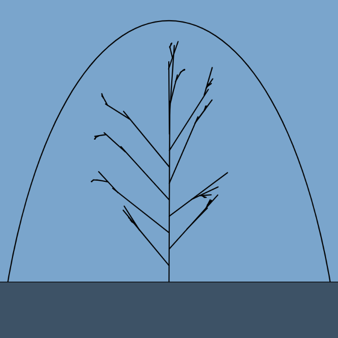

# Waving Reed in a snowglobe (p5.js)

## Introduction
In the previous article I talked about creating waving grass in a p5.js project using typescript. In this article I want to talk about a similar style of sketch but now with a focus on 'tree like structures' with branches as an intermediate step to the full blown trees. This project, as a stepping stone to having actual trees, I call 'Waving reed in a snowglobe'.

### Branches and growth
When you look at how nature makes trees grow there is some algorithmic logic to be distilled right? A sapling starts growing from a seed in the ground towards the sky (or is it away from gravity's pull). Once above ground it will grow further to the sky while expanding it's diameter becoming a more sturdy trunk and and in the meantime branches appear. First one to the left then another to the right. These branches behave like the main branch, grow toward the light, increase in diameter (still relative to the main branch) and develop it's own sub branches.

There are loads of discussions on how to solve this problem, think of fractal like behaviour, attraction based growth algorithms etc.

## Sun as an attractor
For this implementations I started out with a very naive approach (I like naive very much) with a virtual walker object that will first draw the main branch, then at a certain point create a sub branch by walking in a certain direction (preferrably up and not down), preferrably in a different direction than previously, for instance left vs right etc. That turned out to be rather complicated (and boring to be honest) because I ended up writing a lot of silly code like 

    - choose a point on a branch
    - determine the angle of the branch with it's parent branch
    - choose a new angle into a new part of space (based on the rules: not occupied yet and has more light available than the alternatives)
    - etc. 

As you can see a smart guy could pull this of but for me this felt like over-micro-engineering and I quickly realized I had to stop this foolishness. (learned a lot about the P5 Vector system in the process though).

So in the next iteration I tried to solve the problem in another way. I introduced a 'sun' object that traveled through a imaginary curve in the sky that was generating an attraction force that would be used by the growing branch to determine the direction and speed (or length if you will) of the growth.

## The sketch
As with the previous grass demo I also wanted to incorporate the wind force when clicked so if you look at the main sketch (main.ts) you will see the typical P5 methods implemented.

    p5.setup = () => 
    {
        // setup things here
    };

    p5.draw = () => 
    {
        // make use of the P5 drawing loop here
    };

    p5.mousePressed = () =>
    {
        // do something with a mouse click here
    };

# The code
The code for this project can be found at [Github](https://github.com/helena-spawn/reed-demo)

When you clone the repository you will get a project structure like this.

    main-folder/
    ├─ node-modules
    ├─ out
    ├─ src
    │  ├─ factories
    │  │  ├─ reedFactory.ts
    │  │  ├─ snowGlobeFactory.ts
    │  │  ├─ sunFactory.ts
    │  ├─ shapes
    │  │  ├─ bottom.ts
    │  │  ├─ branch.ts
    │  │  ├─ reed.ts
    │  │  ├─ snowGlobe.ts
    │  ├─ directionType.ts
    │  ├─ main.ts
    │  ├─ reedArtist.ts
    ├─ tests
    ├─ index.html
    ├─ package.json
    ├─ readme.md
    ├─ tsconfig.json

## What's with all these factories
You'll notice that for this project I use three factory classes: the `sunFactory`, the `snowGlobeFactory` and the `reedFactory`. You can solve this problem any way you like but I like to treat my objects as complex types with behaviour and I'm usually not very interested in how they are created I just need some method that has all the information available to be able to fullfill my request. The factory pattern suits me very well in that sense. The idea behind the factory pattern is, well very similar to the real life factory concept; you create a factory with all it's machinery, knowledge and resources and you as a factory customer just order a product that this factory can produce. You do not have to know how this product is created, you do not need any info on the resources acquired, scheduling transport etc. That is how I treat my factories. Eventually I want to display a reed object on the canvas and my factory class knows how to create that object.
 
## The snow globe
The `snowGlobe` object is a tongue in cheek representation/visualisation of the arc at which the sun or attractor object can be found at the different intervals. The object is a composite of a simple rectangle object at the bottom and a sun object represented by the curve.

## The sun
The `sun` object then basically is just a curve and an attractor positioned on the curve at time `t` and implements an attract function that takes the end of a branch (in the form of a vector) and a `t`, range 0 to 1 to get a specific location on the curve.

    attract = (branchEnd: P5.Vector, t: number): P5.Vector =>
    {
        const location = this._getLocation(t);
        const force = P5.Vector.sub(location, branchEnd);
        let distance = force.mag();
        distance = this._p5.constrain(distance, 5.0, 25.0);
        force.normalize();
        const strength = this.solarForce * distance;
        force.mult(strength);
        return force;
    }

What I want to express here is a attraction force on a 'growing' branch. This force has a direct relation with the position of the 'sun' on the curve and the distance of the 'growing' branch and the attractor object.

`_getLocation()` is the function to determine a position on the curve at `t` where `t` between 0 and 1 using p5's curvepoint function.

    _getLocation = (t: number): P5.Vector =>
    {
        const x = this._p5.curvePoint(
            this._curveStartControlX, 
            this._curveStartX,
            this._curveEndX, 
            this._curveEndControlX, 
            t);
        const y = this._p5.curvePoint(
            this._curveStartControlY, 
            this._curveStartY,
            this._curveEndY, 
            this._curveEndControlY, 
            t);
        const location = this._p5.createVector(x, y);
        return location;
    }

## The reedFactory
The `reedFactory` class is where all the nasty work of branch creation is done. The `reedFactory` is constructed with details of the canvas we are drawing on and gets a reference to the `sun` object to determine the attraction force at a certain moment in time.

Furthermore the `reedFactory` has the notion of the number of branches it needs to create.

    createReed = (x: number, height: number): Reed =>
    {
        const allBranches = this._create(x, height);
        const reed = new Reed(this._p5, allBranches);

        return reed;
    }

If we break down the `_create` function we can see the following logic.

- create a main trunk
- create a branch on this trunk (loop)
    - while doing that determine the general direction to grow to (EAST or WEST)
    - position the sun in the eastern of western 'hemisphere' 
    - create a branch starting from the parent in the direction of the sun (attractor)
    - and of course use some recursion for the additional sub branches
Which looks like this.

    _create = (x: number, height: number): Array<Branch> =>
    {
        let result = new Array<Branch>();
        
        const trunk = this._createTrunk(x, height);
        result.push(trunk);
        for (let i = 1; i < this._numberOfFirstLevelBranches; i++)
        {
            const direction = this._determineCardinalDirection(i);
            const level = 1 - (i / this._numberOfFirstLevelBranches);
            this._createBranch(trunk, direction, result, i, level, this._numberOfFirstLevelBranches);
        }

        return result;
    }

And the `_createTrunk` implementation itself is just creating a start and end vector and some corresponding control vectors for curve operations.

    _createTrunk = (x: number, height: number): Branch =>
    {
        const start = this._p5.createVector(x, height);
        const end = this._p5.createVector(x, this._drawHeight);
        const startControl = this._createStartControl(start, end);
        const endControl = this._createEndControl(start, end);

        const trunk = new Branch(this._p5, start, startControl, end, endControl, undefined, undefined);
        return trunk;
    }
    
Then this main trunk is handed over to the `_createBranch` method that will create branches with more branches recursively.

    _createBranch = (parent: Branch, 
        direction: DirectionType, 
        branchContainer: Array<Branch>, 
        index: number, 
        level: number, 
        iterations: number): Array<Branch> => 
    {
        // create connector to the parent
        const start = this._getConnectorToTheParent(parent, level);
        
        const end = start.copy();
        
        // some magic nudging of the sun to get a different growth direction
        index = index + this._p5.random(-2, 2); 
        let sunPositionOnCurve = this._determineSunPositionOnCurveForDirection(index, direction);
        const attraction = this._sun.attract(end, sunPositionOnCurve).limit(parent.length / 2.5);
        end.add(attraction);

        const startControl = this._createStartControl(start, end);
        const endControl = this._createEndControl(start, end);

        const branch = new Branch(this._p5, end, endControl, start, startControl, parent, level);
        branchContainer.push(branch);

        if (iterations == 0)
        {  
            return branchContainer;
        }
        else
        {
            // some magic nudging of the level to obtain different connector nodes 
            // in the next recursive call
            const nextLevel = this._p5.constrain(this._p5.randomGaussian(0.3, 0.5), 0.1, 0.8);
            this._createBranch(branch, direction, branchContainer, index, nextLevel, iterations -1);
        }
    }

This method can be broken down in the following logic:
- get a position on the parent branch to start a new branch off
- determine a new position for the sun attractor to get a new heading to grow to
- create a new branch
- with this new branch as the new parent recursively call _createSub to create the new 'offshoot' branch
(see the code repository to examine the details more closely)

## The reed and branch objects
The `branch` object is very similar to the `grass` object from my previous article with just a curve definition and an `animate` function. The main difference can be found in the `rewriteStart` function. The windforce that is moving the branch objects will change the curve of the object, but that means that the connected branch is also moving. The `rewriteStart` function makes sure that the curve's start stays connected to the parent branch.

    rewriteStart = (): void =>
    {
        if (this.parent)
        {
            const x = this._p5.curvePoint(
                this.parent.startControl.x, 
                this.parent.start.x, 
                this.parent.end.x, this.parent.endControl.x, 
                this.level);
            const y = this._p5.curvePoint(
                this.parent.startControl.y, 
                this.parent.start.y, 
                this.parent.end.y, 
                this.parent.endControl.y, 
                this.level);
            this.end = this._p5.createVector(x, y);
        }
    }

The `reed` object is then actually just a container object for the interconnected branches with a `display` and an `animate` function to display and move the branches.

    display = (debug: boolean):void =>
    {
        this._branches.forEach(element => 
        {   
            this._p5.beginShape();
            element.draw(debug);
            element.rewriteStart();
            this._p5.endShape();
        });
    }

    animate = (x: number): void =>
    {
        this._branches.forEach(element => 
        {
            element.animate(x);
        });
    }

## The artist class
And last but not least for convenience I wrap all this into an `artist` class that is constructed with all the factories and provides a simple `create` and `animate` function to the 'user interface' or better said the main class.

The rest of the main setup is then just plumbing.

    const _canvasWidth = 900;
    const _canvasHeight = 900;
    const _bottomMargin = 150;
    const _drawHeight = _canvasHeight - _bottomMargin;
    const _debug = false;

    const hsbColor = p5.floor(p5.randomGaussian(180, 50));
	const _backgroundColor = "hsb(" + hsbColor + " , 40%, 80%)";
    const sunFactory = new SunFactory(p5, _canvasWidth, _canvasHeight);
    const snowGlobeFactory = new SnowGlobeFactory(p5, sunFactory, hsbColor, _canvasWidth, _canvasHeight, _drawHeight);
    const reedFactory = new ReedFactory(p5, _canvasWidth, _drawHeight, _canvasHeight, sunFactory)
    const artist = new ReedArtist(p5, reedFactory, snowGlobeFactory, _canvasWidth, _canvasHeight, _drawHeight)

## The final result

Still no trees but hopefully a step in the right direction. Thanks for reading.

# The source code
[Github](https://github.com/helena-spawn/reed-demo)

